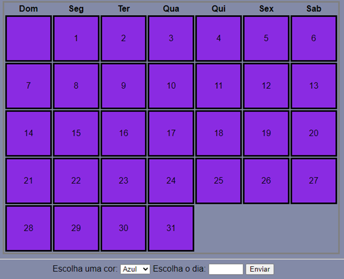
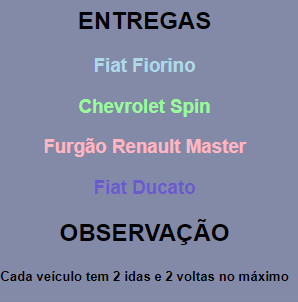

<h1 align="center">Calendário 📅</h1>

           

# Licença
  

# Descrição do Projeto
>Este é um repositório no GitHub que apresenta um projeto prático de desenvolvido com HTML5 e CSS3 E JavaScript.

># Tecnologias utilizadas 🛠️
>* ``HTML5``
>* ``Github`` 
>* ``Git``
>* ``Vscode``
>* ``Java Script``
>* ``CSS3``

##  🛠️Funcionalidades
>- O cliente se organizar através do calendário
>- Uma cor para cada veículo
>- Os funcionários se planejar

## Como utilizar
>1. Olhe o calendário.
>2. Selecione o dia.
>3. Clique no botão "ENVIAR"

# Desenvolvedor do projeto
* [eduardoocosta](https://github.com/eduardoocosta)
* [duardoosta](https://www.instagram.com/duardooosta)
